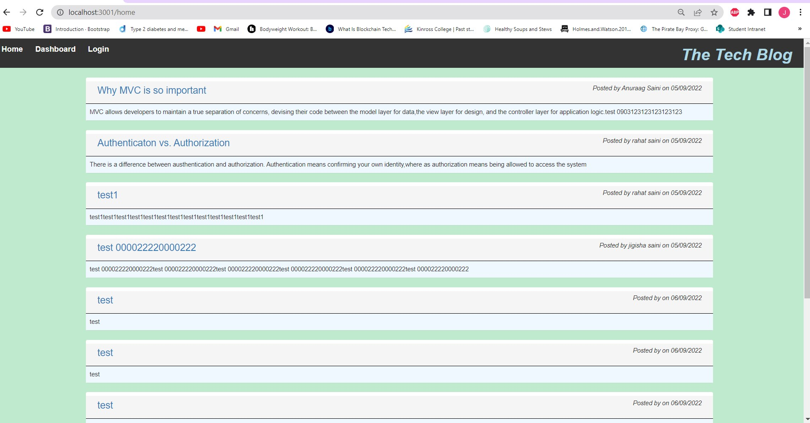
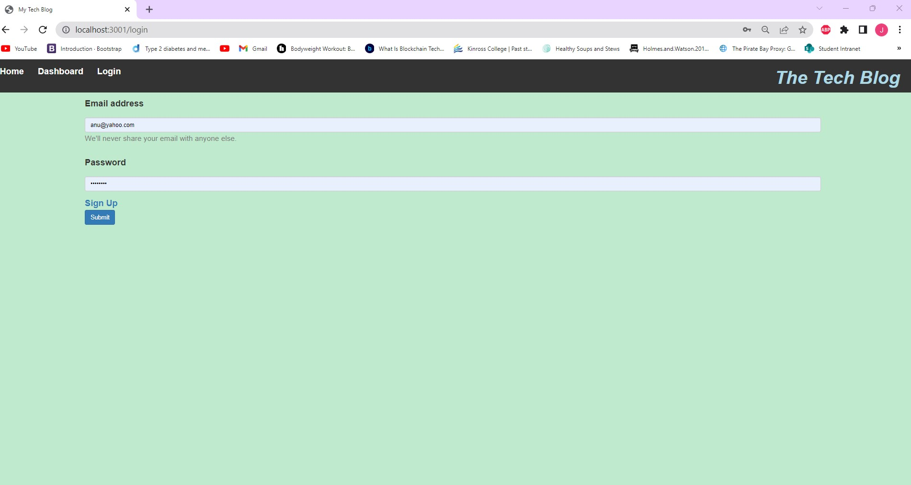
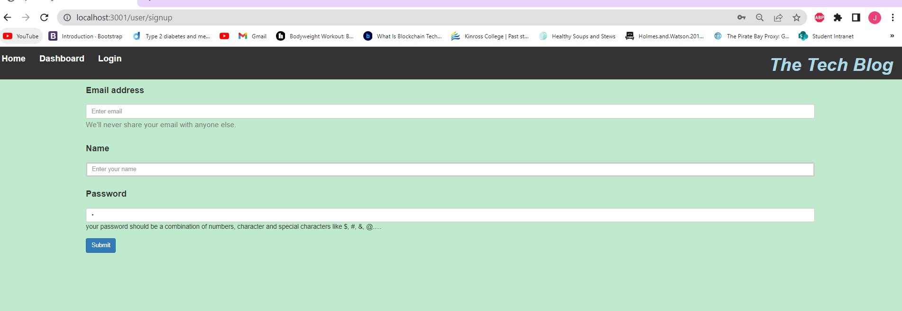
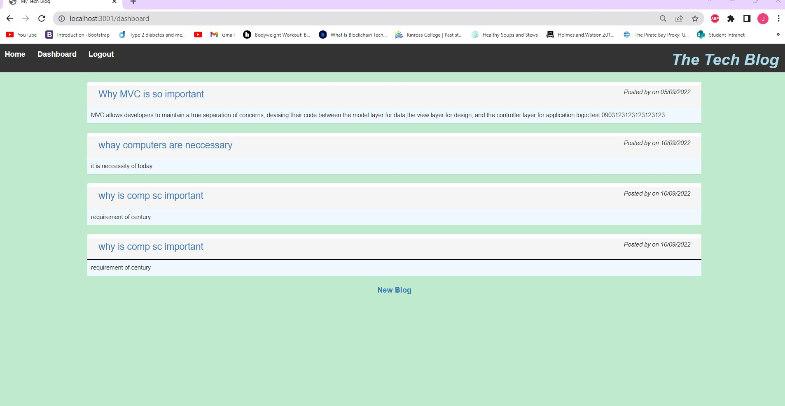
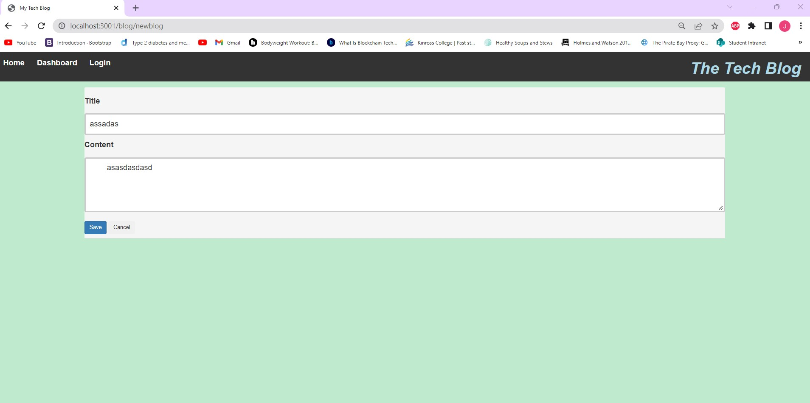
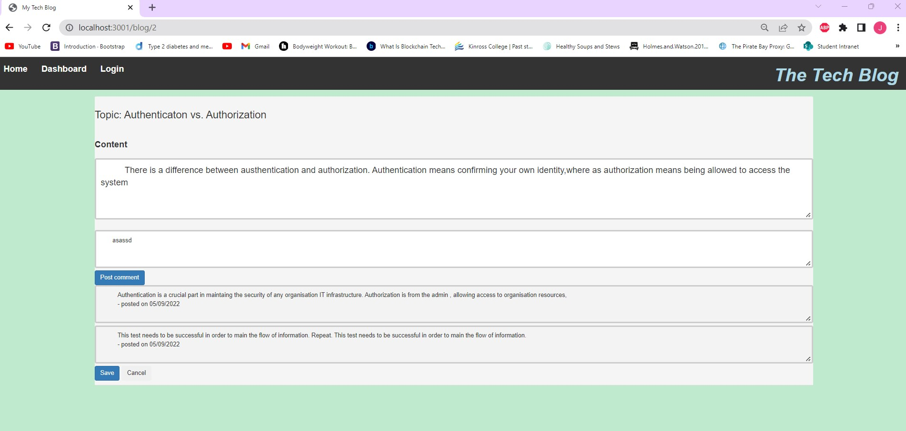

# CMS
This project has been developed for a Content Management System platform where developers and like minded people can post their comments and initiate their blogs after authentication.

# Table of Contents
1. [Description](#Description)
2. [Get_Started](#Get_Started)
3. [Using_the_Application](#Using_the_Application)
4. [Images](#Images)
5. [Questions](#Questions)

## Description 
This application built as CMS provides a easy point of communication for the people to exchange their thaught and ideas on various subject topics techonology. Any developer can initiate a topic after authentication. If he does not have an account, he can follow the links and create an accoutn for himself. He is able to post his comments on other blogs as well as he is able to initiate an topic for comments as well.

## Get Started
you will need to clone repository from https://github.com/Anu-Saini/CMS.git

The project depandencies can be downloaded via npm package manager using npm install command.

We need to create a database 'blog_db' in 'MySql' by loging into mySql using command terminal and typing command 'mysql -u root -p' & typing the mysql password when prompted.

Once the database is created, we need to create tables by running the 'npm start' script.

Once the tables are in place, we need to populate the database by seeding the tables with data by running the script seeds\index.js using terminal

we connect to the server via dotenv.

## Using the Application
The application has been developed with help of both front end and back end code using MVC concept. It creates the front end UI, which helps users to interact with the application.

## Images/Assets
The following images will depict the functionality of the web applicaton

### HomePage

###  loginPage

###  signupPage

###  userdashboard

###  new Blog

###  feedback/comments on earlier posts

### Application  
The application has been hoisted on cloud by using a  cloud service platform called Heroku. The link to the application is : https://blog-managemt.herokuapp.com

## Question / inquiries / suggestions 
For questions can be directed to us at the below addresses :
github Username: Anu_Saini
email :  anuraagsaini@yahoo.co.in
